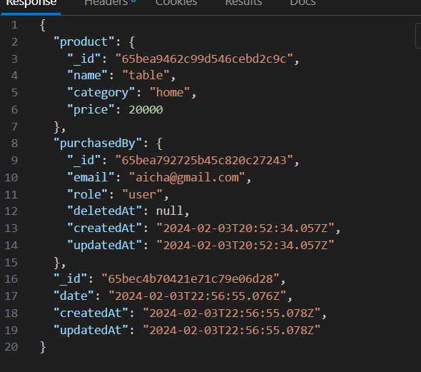

## Datbase Schema

### User

- the User schema have basic informations in order to register and login successfully : username, email,password and role

### Product

Product schema has fundemental fields name,description,quantity, price and category those are all embeded in the same schema we choose to embed those because when we fetch products, we will not need to make additional requests to obtain data about them,..

**"Data that is accessed together should be stored together"** , we arrive at the case of oneToMany here product has many Purchases ,while its okay in some situations to embed the array (for example theres limited small number in the table and its frequently fetched so to avoid expensive joins we embed them) in our situation its better to create a separate collection and reference it because the product can have many purchases (avoiding massive arrays)

### Purchase

Purchase schema has user (purchasedBy) , the quantity of the product to purchase and the date of purchase and reference to product to purchase with some data duplication of it
here we choose an hybride mix of referncing and embeding why:

- in the requirement theres endpoint of stats if we choose reference we will have to do a lookup which is expensive in mongodb to get the detail of the product

- if we choose embeding the whole object we will have data duplication and we will consider updating every purchase document that have the same product

- so we choose hybride so we dont embed the whole object and the data that we will duplicate it wont be updated frequently (name ,category,price )

**NOTE** : i choosed the hybride based on my understanding of the requirement so theres no right or wrong method **it depends** , if the data will change we may opt for the refernce but it will cost us lookups and vise versa

## API endpoints

Product Endpoints :

**POST** Create a new product with request body

- Request
  Endpoint
  

- Response

**GET** Get all products with filtering and pagination

- Request

- Response

**UPDATE** Upadte product

- Request

  

- Response

**DELETE** Delete product

- Request

- Response

Purchase Endpoints:

**POST** Add a purchase

- Request :

- Response

**GET** Purchase statistics (get totalPurchase by the user and get the top **X** Selling products )

- Request :

- Response :

**GET** Visa Cards (external api) with customized size (limit)

- Request

- Response

! [alt text](image-13.png)

## Authentication && Authorization

1. **Authentication**

### Signup

**POST** SIGNUP with RegisterRequestDto as request body

- Request : we're simply creating a user and hashing the password

- Response

### SignIn

**POST** SIGNIN with RegisterRequestDto as request body

- Request
- 1. we provide LoginRequest (email,password)
- 2. we validate (check if user exisits by email)
- 3. if yes we generate a jwt (expire in 1day containing user id and role) else throw erro USER NOT FOUND
- 4. return the access token

2. **Authorization**

- 1. We are restricting the access to USER and ADMIN roles in the Product and Purchase controllers by Using @Role() decorator

- 2. We are adding guard (RoleGuard) checking if the roles restricted to and the user role attempng using the api are equal else throwing **UNAUTHORIZATION exception**

- 3. We are adding another guard (AccessTokenGuard) checking if the provided token is valid else throwing **UNAUTHORIZATION exception**

## Docker and Containisation

### Docker file

- we have a multistage docker file in the frist stage we name our alpine image builder we set aworking directory inside the conatiner then we copy the package.json and we install the dependencies and then we copy the rest of the code into it and we run the build

- we start a new stage and we set a working directory then we copy the output of the build and we copy the node module folder,tsconfig and .env files and then we run the npm command at the container startup

- we have also a dockerignore to exclude node modules when building the docker image( so it wont be part of the image)

### Docker compose file

- in the docker compose we have 3 services

- nest js container (our backend) exposing 3500 port and have a volume for persisting images for example

- mongodb service our database that have volume to persist data

- mongo express a gui for database admenistration

- finally have a network so the services can communicate with each other
